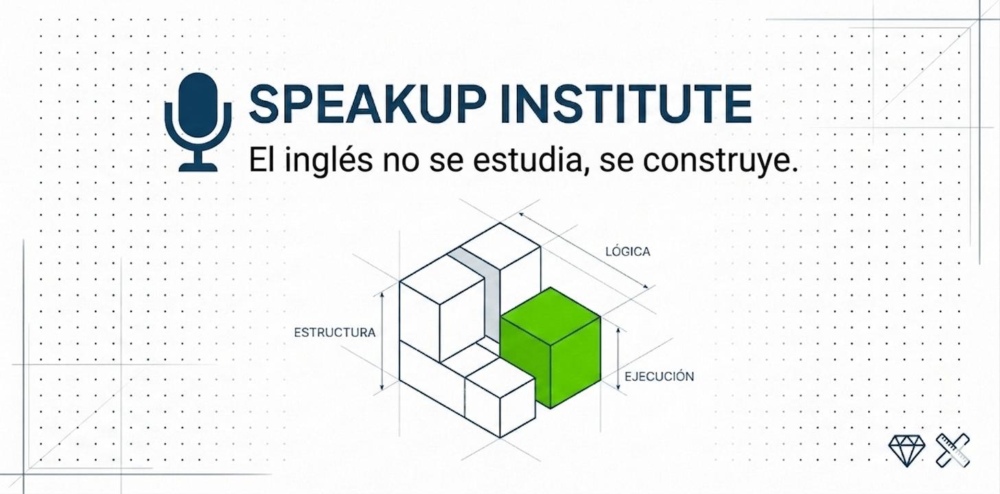

<p align="center">
  
</p>

# 🏗️ SpeakUp Institute

> **El inglés no se estudia, se construye.**

<p align="center">
  <a href="https://speakupinstitute.net/">🌐 Ver sitio</a>
</p>

<p align="center">
  
  
  
  
  
</p>

---

## 📖 ¿Qué es SpeakUp?

SpeakUp Institute es un sistema de aprendizaje de inglés basado en **estructura, lógica y ejecución**.

No añadimos más contenido.  
Construimos una base que permite usar el idioma con claridad.

> La memoria falla. La estructura permanece.

---

## 🎯 Nuestra Tesis

En un mercado saturado de promesas rápidas, SpeakUp se posiciona como el arquitecto de la comunicación.

No enseñamos a memorizar.  
Diseñamos estructuras para usar el idioma bajo presión.

---

## 🔨 Pilares del Sistema

- **Lógica estructural** → Todo tiene un porqué  
- **Honestidad radical** → Sin atajos, pero sin perder tiempo  
- **Minimalismo funcional** → Solo lo que se usa  
- **Build in Public** → Evolución constante  

---

## 🎓 Cómo funciona el aprendizaje

1. **Diagnostica** → Identifica vacíos reales  
2. **Entiende** → Aprende la lógica estructural  
3. **Practica** → Ejecuta en el Skill Lab  
4. **Refuerza** → Consolida con uso real  
5. **Evoluciona** → Construye sobre una base sólida  

---

## 📦 Qué incluye

- Módulos estructurados (no clases tradicionales)  
- Skill Lab (práctica real)  
- Roadmap de aprendizaje  
- Sistema basado en ejecución  

---

## 🛠️ Stack Tecnológico

- Next.js  
- TypeScript  
- TailwindCSS  
- MDX  
- Vercel  

---

## ⚙️ Instalación
```bash
git clone https://github.com/Mslealt1994/SpeakUp_Institute.git
cd speakup-institute
npm install
npm run dev
```

---

## 🚀 Uso

Ejecuta el proyecto localmente y explora:

- Landing page  
- Contenido del blog  
- Estructura del proyecto  

Este proyecto está enfocado en **fundación e iteración**, no en funcionalidades finales.

---

## 🤝 Contribución

Este proyecto se construye en público.

Puedes:

- Abrir issues  
- Proponer mejoras  
- Compartir ideas  
- Participar como colaborador  

No estamos construyendo solo un producto. Estamos construyendo un sistema.

---

## 📌 Estado

🚧 Desarrollo activo — etapa temprana

El progreso, las decisiones y los errores se documentan abiertamente. El objetivo no es avanzar rápido, sino construir algo que realmente funcione.

---

<p align="center">
  <strong>Deja de memorizar. Empieza a construir.</strong>
</p>